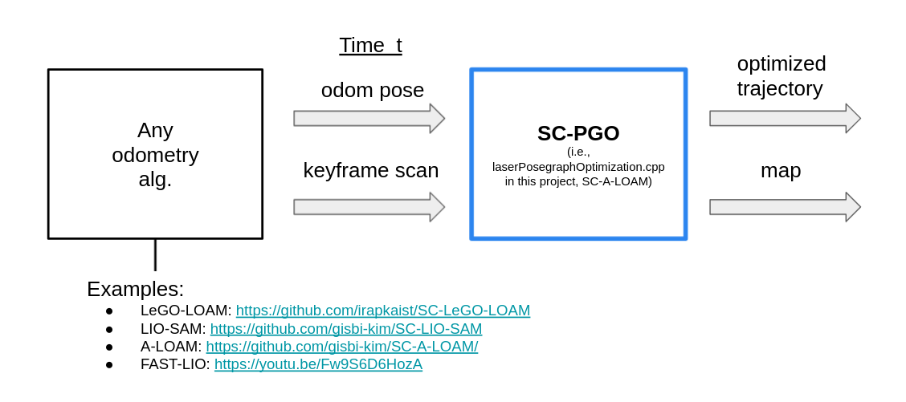

# SC-A-LOAM

## What is SC-A-LOAM? 
- A real-time LiDAR SLAM package that integrates A-LOAM and ScanContext. 
    - **A-LOAM** for odometry (i.e., consecutive motion estimation)
    - **ScanContext** for coarse global localization that can deal with big drifts (i.e., place recognition as kidnapped robot problem without initial pose)
    - and iSAM2 of GTSAM is used for pose-graph optimization. 
- This package aims to show ScanContext's handy applicability. 
    - The only things a user should do is just to include `Scancontext.h`, call `makeAndSaveScancontextAndKeys` and `detectLoopClosureID`. 

## Dependencies
- ROS (geometry_msgs, nav_msgs, sensor_msgs, roscpp, rospy, rosbag, std_msgs, image_transport, cv_bridge, tf)
- PCL
- OpenCV
- Ceres
- OpenMP
- GTSAM
- GeographicLib

## Features 
1.  A strong place recognition and loop closing 
    - We integrated ScanContext as a loop detector into A-LOAM, and ISAM2-based pose-graph optimization is followed. (see https://youtu.be/okML_zNadhY?t=313 to enjoy the drift-closing moment)
2. A modular implementation 
    - The only difference from A-LOAM is the addition of the `laserPosegraphOptimization.cpp` file. In the new file, we subscribe the point cloud topic and odometry topic (as a result of A-LOAM, published from `laserMapping.cpp`). That is, our implementation is generic to any front-end odometry methods. Thus, our pose-graph optimization module (i.e., `laserPosegraphOptimization.cpp`) can easily be integrated with any odometry algorithms such as non-LOAM family or even other sensors (e.g., visual odometry).  
    - <p align="center"></p>
3. (optional) Altitude stabilization using consumer-level GPS  
    - To make a result more trustworthy, we supports GPS (consumer-level price, such as U-Blox EVK-7P)-based altitude stabilization. The LOAM family of methods are known to be susceptible to z-errors in outdoors. We used the robust loss for only the altitude term. For the details, see the variable `robustGPSNoise` in the `laserPosegraphOptimization.cpp` file. 

## How to use? 
- First, install the abovementioned dependencies, and follow below lines. 
```
    mkdir -p ~/catkin_scaloam_ws/src
    cd ~/catkin_scaloam_ws/src
    git clone https://github.com/gisbi-kim/SC-A-LOAM.git
    cd ../
    catkin_make
    source ~/catkin_scaloam_ws/devel/setup.bash
    roslaunch aloam_velodyne aloam_mulran.launch # for MulRan dataset setting 
```
